---
## Front matter
lang: ru-RU
title: Лабораторная работа №5
subtitle: Дискреционное разграничение прав в Linux. Исследование влияния дополнительных атрибутов
author: Victoria M. Shutenko
institute: RUDN University, Moscow, Russian Federation
date: 8 October, 2022, Moscow, Russian Federation

## Formatting
toc: false
slide_level: 2
theme: metropolis
header-includes: 
 - \metroset{progressbar=frametitle,sectionpage=progressbar,numbering=fraction}
 - '\makeatletter'
 - '\beamer@ignorenonframefalse'
 - '\makeatother'
aspectratio: 43
section-titles: true
---

# Цель выполнения лабораторной работы

Изучение механизмов изменения идентификаторов, применения
SetUID- и Sticky-битов. Получение практических навыков работы в консоли с дополнительными атрибутами. Рассмотрение работы механизма
смены идентификатора процессов пользователей, а также влияние бита
Sticky на запись и удаление файлов.1

# Результаты выполнения лабораторной работ

## Создание программы

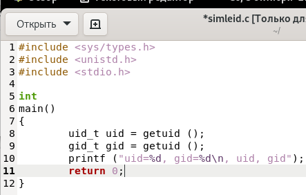{ #fig:002 width=70% }

## Создание программы

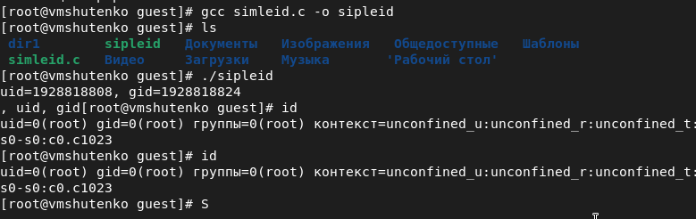{ #fig:003 width=70% }

## Создание программы

{ #fig:004 width=70% }

## Создание программы

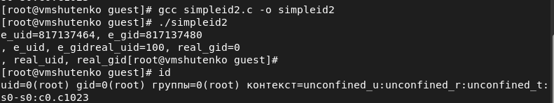{ #fig:005 width=50% }

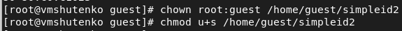{ #fig:006 width=50% }

## Создание программы

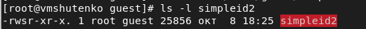{ #fig:007 width=50% }

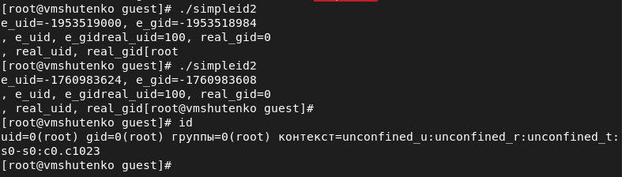{ #fig:008 width=50% }

## Создание программы

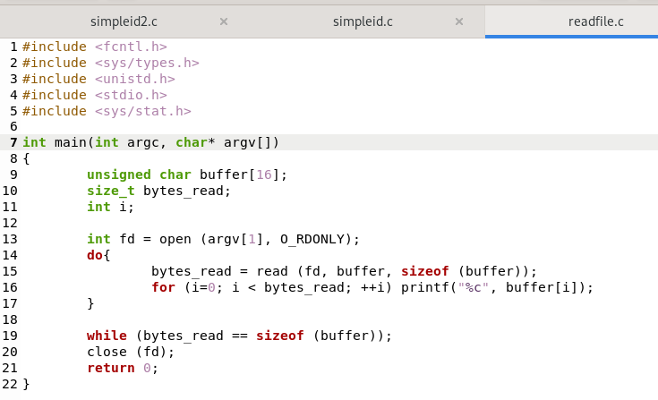{ #fig:009 width=70% }

## Создание программы

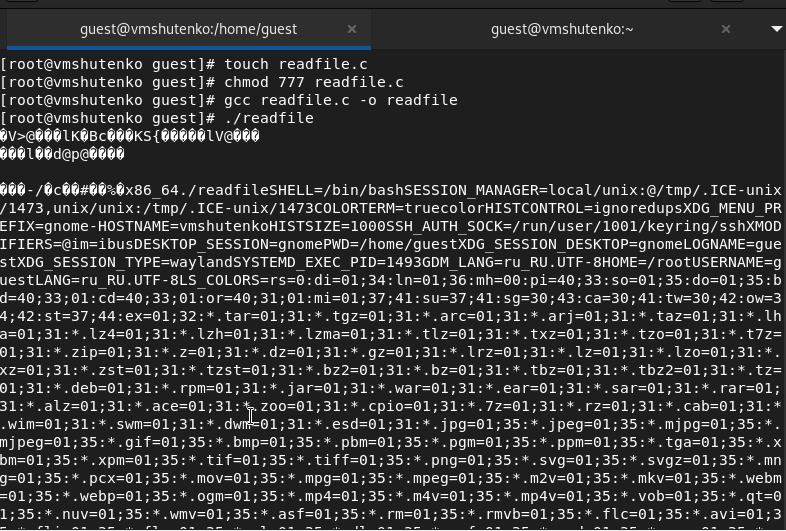{ #fig:010 width=50% }

## Создание программы

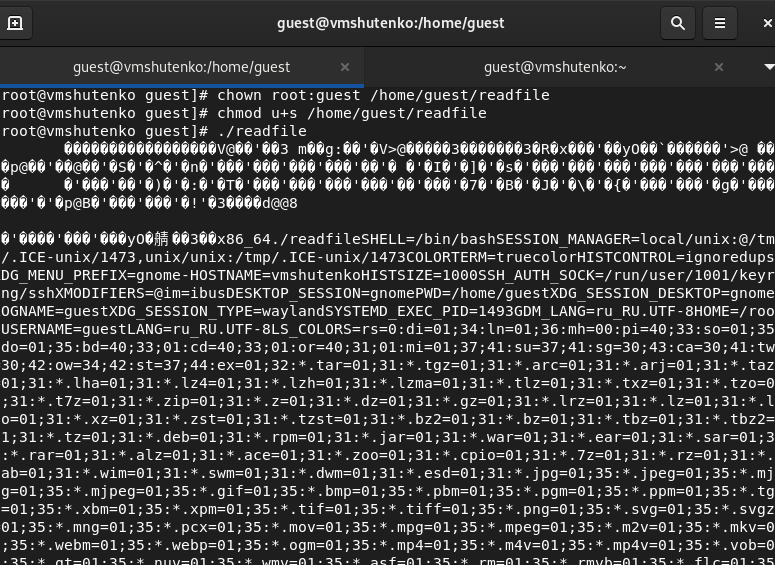{ #fig:011 width=50% }

## Создание программы

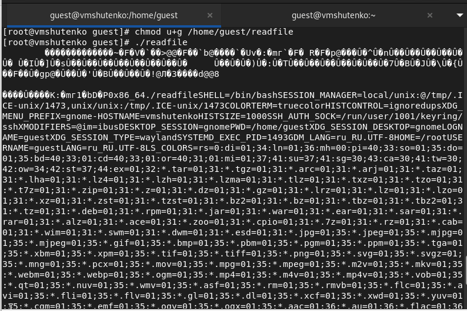{ #fig:012 width=50% }

## Исследование Sticky-бита

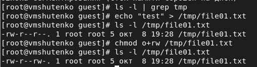{ #fig:013 width=70% }

## Исследование Sticky-бита

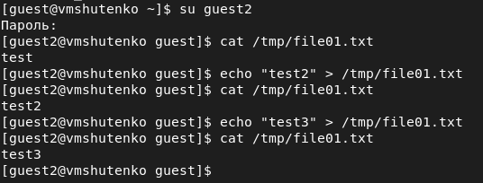{ #fig:014 width=70% }

## Исследование Sticky-бита

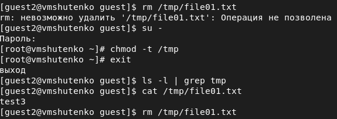{ #fig:015 width=70% }

# Итоги выполнения лабораторной работы

- Получили практические навыки работы в консоли с дополнительными атрибутами.
- Создали 3 файла, скомпилировали их и запустили
