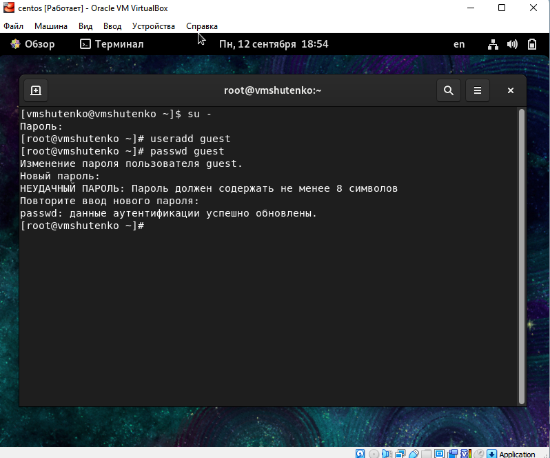
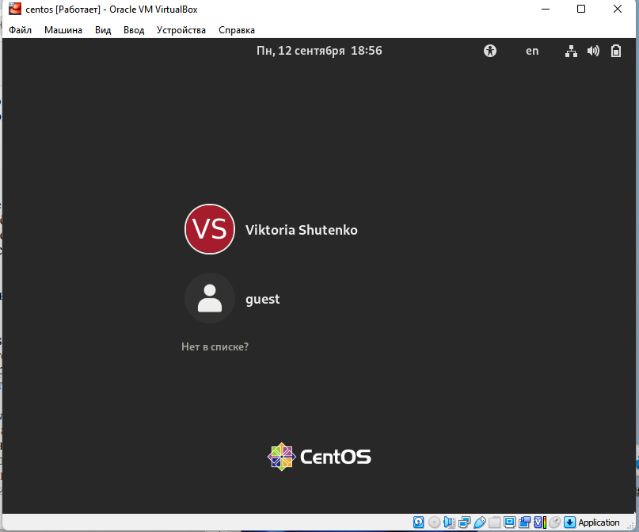
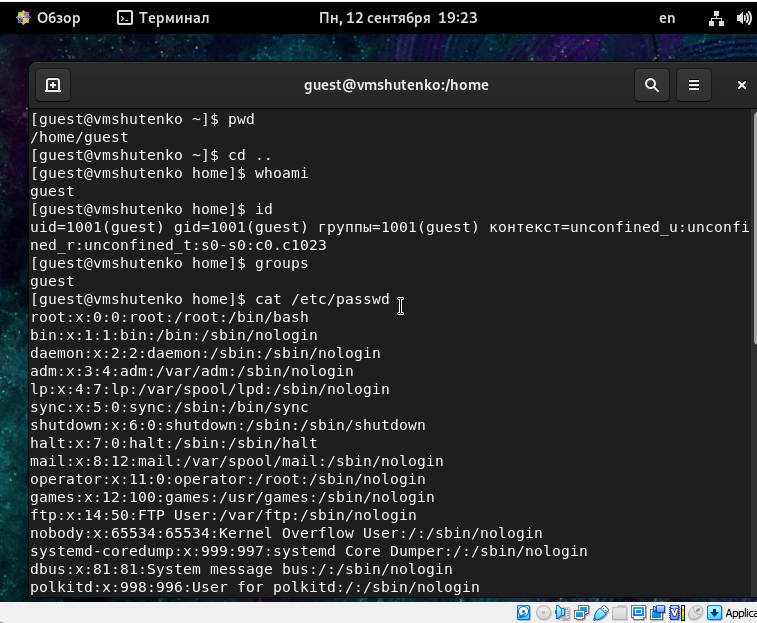
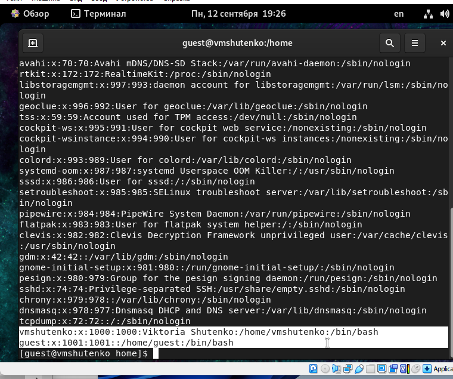
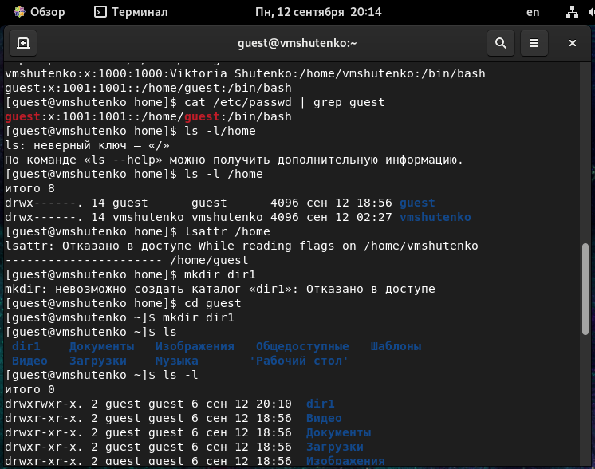

---
## Front matter
lang: ru-RU
title: Лабораторная работа №2
subtitle: Дискреционное разграничение прав в Linux. Основные атрибуты.
author: Victoria M. Shutenko
institute: RUDN University, Moscow, Russian Federation
date: 17 September, 2022, Moscow, Russian Federation

## Formatting
toc: false
slide_level: 2
theme: metropolis
header-includes: 
 - \metroset{progressbar=frametitle,sectionpage=progressbar,numbering=fraction}
 - '\makeatletter'
 - '\beamer@ignorenonframefalse'
 - '\makeatother'
aspectratio: 43
section-titles: true
---
# Цель выполнения лабораторной работы

Приобрести практические навыки в работы в консоли с атрибутами файлов, закрепление теоретических основ дискреционного разграничения доступа в современных системах с открытым кодом на базе ОС Linux.

# Результаты выполнения лабораторной работы

{ #fig:001 width=70% }

# Результаты выполнения лабораторной работы

{ #fig:002 width=70% }

# Результаты выполнения лабораторной работы

{ #fig:003 width=70% }

# Результаты выполнения лабораторной работы

{ #fig:004 width=70% }

# Результаты выполнения лабораторной работы

{ #fig:005 width=70% }

# Результаты выполнения лабораторной работы

{ #fig:006 width=70% }

# Итоги выполнения лабораторной работы

- Создан пользователь guest
- Создан подкаталог dir1
- Заполнена таблица «Установленные права и разрешённые действия»
