---
## Front matter
lang: ru-RU
title: Лабораторная работа №3
subtitle: Дискреционное разграничение прав в Linux. Два пользователя
author: Victoria M. Shutenko
institute: RUDN University, Moscow, Russian Federation
date: 24 September, 2022, Moscow, Russian Federation

## Formatting
toc: false
slide_level: 2
theme: metropolis
header-includes: 
 - \metroset{progressbar=frametitle,sectionpage=progressbar,numbering=fraction}
 - '\makeatletter'
 - '\beamer@ignorenonframefalse'
 - '\makeatother'
aspectratio: 43
section-titles: true
---

# Цель выполнения лабораторной работы

Приобрести практические навыки работы в консоли с атрибутами файлов для групп пользователей.

# Результаты выполнения лабораторной работы

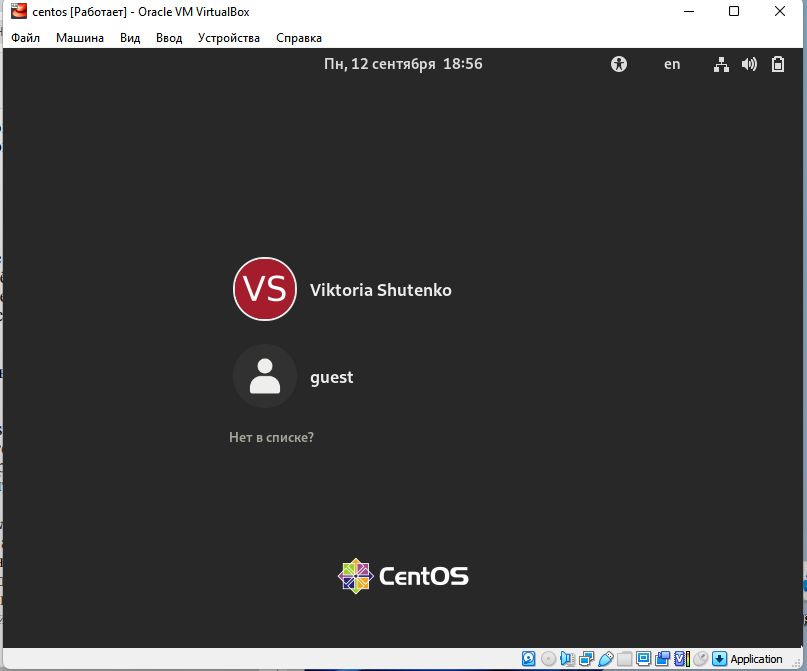{ #fig:001 width=70% }

#Результаты выполнения лабораторной работы

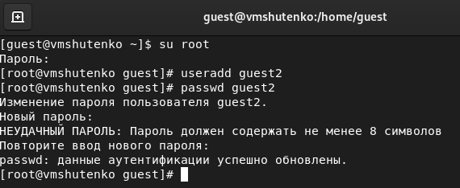{ #fig:001 width=70% }

# Результаты выполнения лабораторной работы

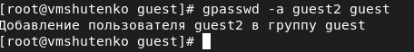{ #fig:001 width=70% }

# Результаты выполнения лабораторной работы

 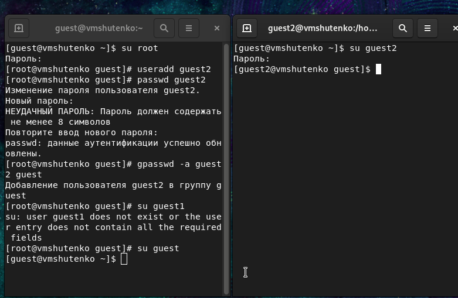{ #fig:001 width=70% }

# Результаты выполнения лабораторной работы

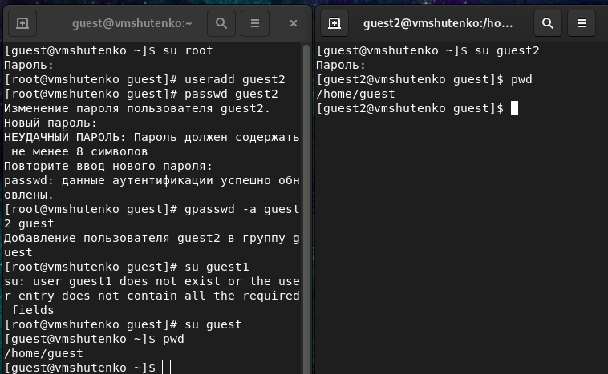{ #fig:001 width=70% }

# Результаты выполнения лабораторной работы

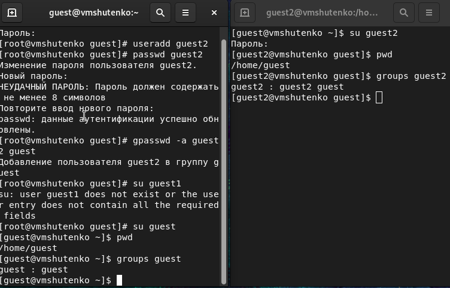{ #fig:001 width=40% }

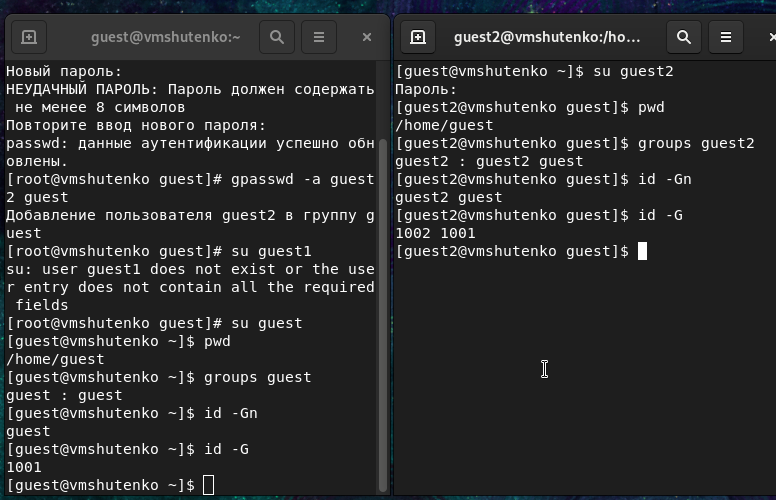{ #fig:001 width=40% }

# Результаты выполнения лабораторной работы

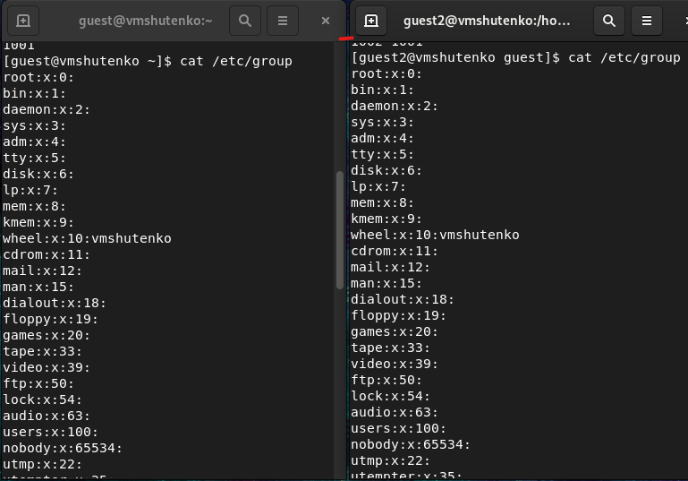{ #fig:001 width=30% }

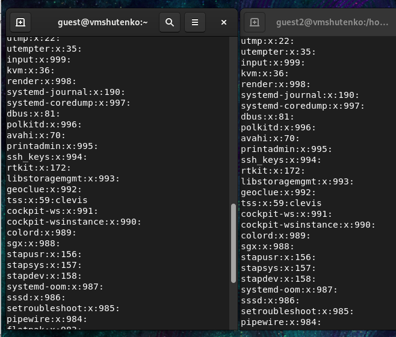{ #fig:001 width=30% }

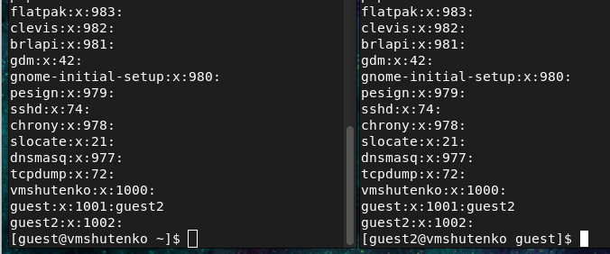{ #fig:001 width=30% }

# Результаты выполнения лабораторной работы

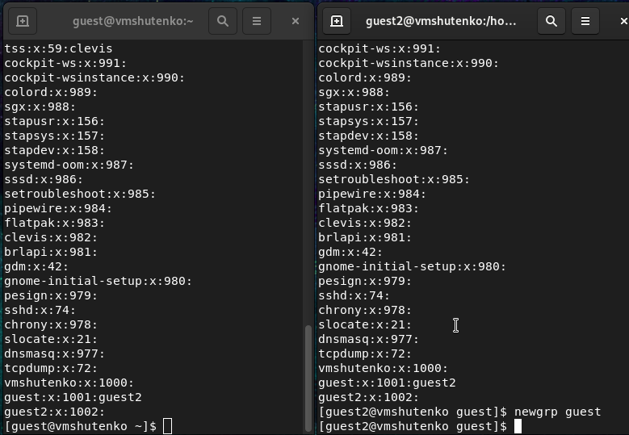{ #fig:001 width=70% }

# Результаты выполнения лабораторной работы

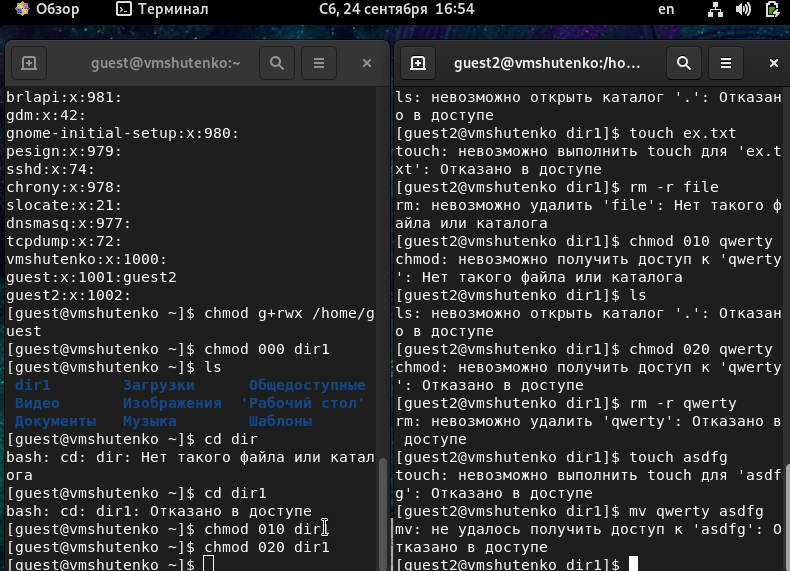{ #fig:001 width=70% }

# Итоги выполнения лабораторной работы

- Создан пользователь guest2
- Заполнена таблица «Установленные права и разрешённые действия»
