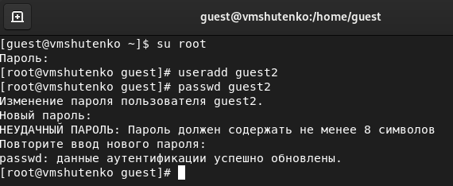
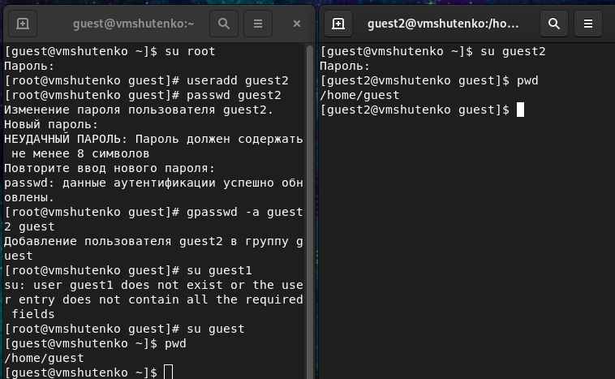
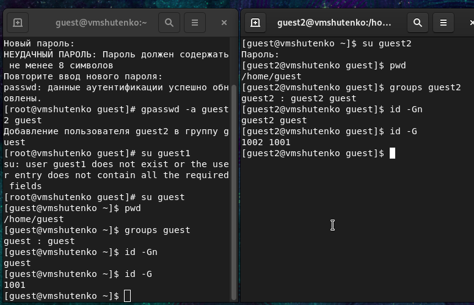
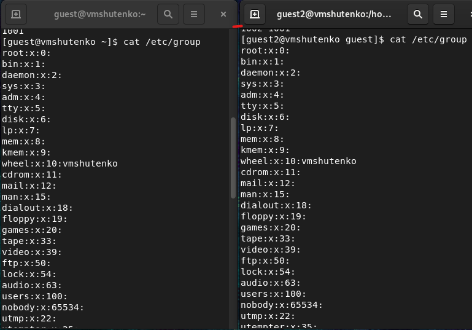

---
# Front matter
title: "Отчёт по лабораторной работе №3"
subtitle: "Дискреционное
разграничение прав в Linux. Основные
атрибуты
"
author: "Виктория Михайловна Шутенко"

# Generic otions
lang: ru-RU
toc-title: "Содержание"

# Bibliography
bibliography: bib/cite.bib
csl: pandoc/csl/gost-r-7-0-5-2008-numeric.csl

# Pdf output format
toc: true # Table of contents
toc_depth: 2
lof: true # List of figures
lot: true # List of tables
fontsize: 12pt
linestretch: 1.5
papersize: a4
documentclass: scrreprt
## I18n
polyglossia-lang:
  name: russian
  options:
	- spelling=modern
	- babelshorthands=true
polyglossia-otherlangs:
  name: english
  name: el
### Fonts
mainfont: PT Serif
romanfont: PT Serif
sansfont: PT Sans
monofont: PT Mono
mainfontoptions: Ligatures=TeX
romanfontoptions: Ligatures=TeX
sansfontoptions: Ligatures=TeX,Scale=MatchLowercase
monofontoptions: Scale=MatchLowercase,Scale=0.9
## Biblatex
biblatex: true
biblio-style: "gost-numeric"
biblatexoptions:
  - parentracker=true
  - backend=biber
  - hyperref=auto
  - language=auto
  - autolang=other*
  - citestyle=gost-numeric
## Misc options
indent: true
header-includes:
  - \linepenalty=10 # the penalty added to the badness of each line within a paragraph (no associated penalty node) Increasing the value makes tex try to have fewer lines in the paragraph.
  - \interlinepenalty=0 # value of the penalty (node) added after each line of a paragraph.
  - \hyphenpenalty=50 # the penalty for line breaking at an automatically inserted hyphen
  - \exhyphenpenalty=50 # the penalty for line breaking at an explicit hyphen
  - \binoppenalty=700 # the penalty for breaking a line at a binary operator
  - \relpenalty=500 # the penalty for breaking a line at a relation
  - \clubpenalty=150 # extra penalty for breaking after first line of a paragraph
  - \widowpenalty=150 # extra penalty for breaking before last line of a paragraph
  - \displaywidowpenalty=50 # extra penalty for breaking before last line before a display math
  - \brokenpenalty=100 # extra penalty for page breaking after a hyphenated line
  - \predisplaypenalty=10000 # penalty for breaking before a display
  - \postdisplaypenalty=0 # penalty for breaking after a display
  - \floatingpenalty = 20000 # penalty for splitting an insertion (can only be split footnote in standard LaTeX)
  - \raggedbottom # or \flushbottom
  - \usepackage{float} # keep figures where there are in the text
  - \floatplacement{figure}{H} # keep figures where there are in the text

---

# Цель работы

Приобрести практические навыки работы в консоли с атрибутами файлов для групп пользователей.

# Ход работы 

1. Первый пользователь был создан во второй лабораторной работе.

2. Проверила его наличие

{ #fig:001 width=70% }

3. Создала второго пользователя guest2:

```useradd guest2```

```passwd guest2``` 

{ #fig:001 width=70% }

4. Добавила пользователя guest2 в группу guest:

``` 
gpasswd -a guest2 guest
```

{ #fig:001 width=70% }

5. Осуществила вход в систему от двух пользователей на двух разных консолях: guest на первой консоли и guest2 на второй консоли:

 { #fig:001 width=70% }

6. Для обоих пользователей командой ```pwd``` определила директорию, в которой нахожусь. 

{ #fig:001 width=70% }

7. Уточнила имя моего пользователя, его группу, кто входит в неё и к каким группам принадлежит он сам. Определила командами:

```
groups guest 

groups guest2
```
Сравните выводы команды groups с выводом команд

```
id -Gn 

id -G
```

{ #fig:001 width=70% }


{ #fig:001 width=70% }

8. Сравнила полученную информацию с содержимым файла /etc/group. Просмотрела файл командой.
```
cat /etc/group
```
{ #fig:001 width=70% }

{ #fig:001 width=70% }

{ #fig:001 width=70% }

9. От имени пользователя guest2 выполнила регистрацию пользователя guest2 в группе guest командой:
```
newgrp guest
```

{ #fig:001 width=70% }

10. От имени пользователя guest изменила  права директории /home/guest, разрешив все действия для пользователей группы:
```
chmod g+rwx /home/guest
```

{ #fig:001 width=70% }

11. От имени пользователя guest сняла с директории /home/guest/dir1 все атрибуты командой

```chmod 000 dirl```

{ #fig:001 width=70% }

12. Заполнила таблицу «Установленные права и разрешённые действия»
Меняя атрибуты у директории dir1 и файла file1 от имени пользователя guest и делая проверку от пользователя guest2, заполнила табл. 3.1, определив опытным путём, какие операции разрешены, а какие нет. Если операция разрешена, занесла в таблицу знак «+», если не разрешена, знак «-».
Сравните табл. 2.1 (из лабораторной работы № 2) и табл. 3.1.

|Права директории|Права ф|Создание ф|Удаление ф|Запись в ф|Чтение ф|Смена директории|Просмотр файлов в директории|Переименование ф|Смена атриб|
| d(000)         |  000  |    -     |    -     |    -     |   -    |     -          |         -                  |       -        |    -      |
| d(000)         |  100  |    -     |    -     |    -     |   -    |     -          |         -                  |       -        |    -      |
| d(000)         |  200  |    -     |    -     |    -     |   -    |     -          |         -                  |       -        |    -      |
| d(000)         |  300  |    -     |    -     |    -     |   -    |     -          |         -                  |       -        |    -      |
| d(000)         |  400  |    -     |    -     |    -     |   -    |     -          |         -                  |       -        |    -      |
| d(000)         |  500  |    -     |    -     |    -     |   -    |     -          |         -                  |       -        |    -      |
| d(000)         |  600  |    -     |    -     |    -     |   -    |     -          |         -                  |       -        |    -      |
| d(000)         |  700  |    -     |    -     |    -     |   -    |     -          |         -                  |       -        |    -      |
| d(100)         |  000  |    -     |    -     |    -     |   -    |     +          |         -                  |       -        |    +      |
| d(100)         |  100  |    -     |    -     |    -     |   -    |     +          |         -                  |       -        |    +      |
| d(100)         |  200  |    -     |    -     |    +     |   -    |     +          |         -                  |       -        |    +      |
| d(100)         |  300  |    -     |    -     |    +     |   -    |     +          |         -                  |       -        |    +      |
| d(100)         |  400  |    -     |    -     |    -     |   +    |     +          |         -                  |       -        |    +      |
| d(100)         |  500  |    -     |    -     |    -     |   +    |     +          |         -                  |       -        |    +      |
| d(100)         |  600  |    -     |    -     |    +     |   +    |     +          |         -                  |       -        |    +      |
| d(100)         |  700  |    -     |    -     |    +     |   +    |     +          |         -                  |       -        |    +      |
| d(200)         |  000  |    -     |    -     |    -     |   -    |     -          |         -                  |       -        |    +      |
| d(200)         |  100  |    -     |    -     |    -     |   -    |     -          |         -                  |       -        |    +      |
| d(200)         |  200  |    -     |    -     |    -     |   -    |     -          |         -                  |       -        |    +      |
| d(200)         |  300  |    -     |    -     |    -     |   -    |     -          |         -                  |       -        |    +      |
| d(200)         |  400  |    -     |    -     |    -     |   -    |     -          |         -                  |       -        |    +      |
| d(200)         |  500  |    -     |    -     |    -     |   -    |     -          |         -                  |       -        |    +      |
| d(200)         |  600  |    -     |    -     |    -     |   -    |     -          |         -                  |       -        |    +      |
| d(200)         |  700  |    -     |    -     |    -     |   -    |     -          |         -                  |       -        |    +      |
| d(300)         |  000  |    +     |    +     |    -     |   -    |     +          |         -                  |       -        |    +      |
| d(300)         |  100  |    +     |    +     |    -     |   -    |     +          |         -                  |       -        |    +      |
| d(300)         |  200  |    +     |    +     |    -     |   -    |     +          |         -                  |       -        |    +      |
| d(300)         |  300  |    +     |    +     |    +     |   -    |     +          |         -                  |       -        |    +      |
| d(300)         |  400  |    +     |    +     |    +     |   +    |     +          |         -                  |       -        |    +      |
| d(300)         |  500  |    +     |    +     |    +     |   +    |     +          |         -                  |       -        |    +      |
| d(300)         |  600  |    +     |    +     |    +     |   +    |     +          |         -                  |       -        |    +      |
| d(300)         |  700  |    +     |    +     |    +     |   +    |     +          |         -                  |       -        |    +      |
| d(400)         |  000  |    -     |    -     |    -     |   -    |     -          |         -                  |       -        |    +      |
| d(400)         |  100  |    -     |    -     |    -     |   -    |     -          |         -                  |       -        |    +      |
| d(400)         |  200  |    -     |    -     |    -     |   -    |     -          |         -                  |       -        |    +      |
| d(400)         |  300  |    -     |    -     |    -     |   -    |     -          |         -                  |       -        |    +      |
| d(400)         |  400  |    -     |    -     |    -     |   -    |     -          |         -                  |       -        |    +      |
| d(400)         |  500  |    -     |    -     |    -     |   -    |     -          |         -                  |       -        |    +      |
| d(400)         |  600  |    -     |    -     |    -     |   -    |     -          |         -                  |       -        |    +      |
| d(400)         |  700  |    -     |    -     |    -     |   -    |     -          |         -                  |       -        |    +      |
| d(500)         |  000  |    -     |    -     |    -     |   -    |     +          |         +                  |       -        |    +      |
| d(500)         |  100  |    -     |    -     |    -     |   -    |     +          |         +                  |       -        |    +      |
| d(500)         |  200  |    -     |    -     |    -     |   -    |     +          |         +                  |       -        |    +      |
| d(500)         |  300  |    -     |    -     |    +     |   -    |     +          |         +                  |       -        |    +      |
| d(500)         |  400  |    -     |    -     |    +     |   +    |     +          |         +                  |       -        |    +      |
| d(500)         |  500  |    -     |    -     |    +     |   +    |     +          |         +                  |       -        |    +      ||
| d(500)         |  600  |    -     |    -     |    +     |   +    |     +          |         +                  |       -        |    +      |
| d(500)         |  700  |    -     |    -     |    +     |   +    |     +          |         +                  |       -        |    +      |
| d(600)         |  000  |    -     |    -     |    -     |   -    |     -          |         -                  |       -        |    +      |
| d(600)         |  100  |    -     |    -     |    -     |   -    |     -          |         -                  |       -        |    +      |
| d(600)         |  200  |    -     |    -     |    -     |   -    |     -          |         -                  |       -        |    +      |
| d(600)         |  300  |    -     |    -     |    -     |   -    |     -          |         -                  |       -        |    +      |
| d(600)         |  400  |    -     |    -     |    -     |   -    |     -          |         -                  |       -        |    +      |
| d(600)         |  500  |    -     |    -     |    -     |   -    |     -          |         -                  |       -        |    +      |
| d(600)         |  600  |    -     |    -     |    -     |   -    |     -          |         -                  |       -        |    +      |
| d(600)         |  700  |    -     |    -     |    -     |   -    |     -          |         -                  |       -        |    +      |
| d(700)         |  000  |    +     |    +     |    -     |   -    |     +          |         -                  |       -        |    +      |
| d(700)         |  100  |    +     |    +     |    -     |   -    |     +          |         -                  |       +        |    +      |
| d(700)         |  200  |    +     |    +     |    -     |   -    |     +          |         -                  |       +        |    +      |
| d(700)         |  300  |    +     |    +     |    +     |   -    |     +          |         -                  |       +        |    +      |
| d(700)         |  400  |    +     |    +     |    +     |   +    |     +          |         -                  |       +        |    +      |
| d(700)         |  500  |    +     |    +     |    +     |   +    |     +          |         -                  |       +        |    +      |
| d(700)         |  600  |    +     |    +     |    +     |   +    |     +          |         +                  |       +        |    +      |
| d(700)         |  700  |    +     |    +     |    +     |   +    |     +          |         +                  |       +        |    +      |

# Библиография{.unnumbered}

1. Зегжда Д. П., Ивашко А. М. Основы безопасности информационных систем. — М.: Горячая линия — Телеком, 2016. — 452 с.
2. Мэйволд Э. Безопасность сетей. Эком, 2016 г., 528 с. — http://www.intuit.ru/department/security/netsec/


::: {#refs}
:::


