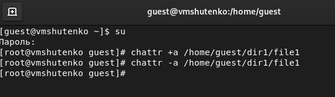
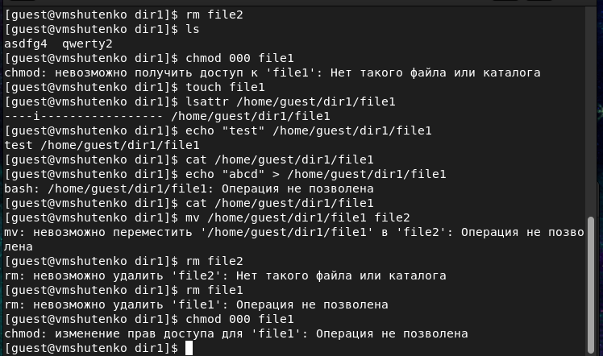

---
## Front matter
lang: ru-RU
title: Лабораторная работа №4
subtitle: Дискреционное разграничение прав в Linux. Расширенные атрибуты
author: Victoria M. Shutenko
institute: RUDN University, Moscow, Russian Federation
date: 30 September, 2022, Moscow, Russian Federation

## Formatting
toc: false
slide_level: 2
theme: metropolis
header-includes: 
 - \metroset{progressbar=frametitle,sectionpage=progressbar,numbering=fraction}
 - '\makeatletter'
 - '\beamer@ignorenonframefalse'
 - '\makeatother'
aspectratio: 43
section-titles: true
---

# Цель выполнения лабораторной работы

Получение практических навыков работы в консоли с расширенными атрибутами файлов.

# Результаты выполнения лабораторной работы

## Расширенный атрибута а 

{ #fig:001 width=70% }

## Выполнение основных команд

{ #fig:002 width=70% }

## Снятие атрибутов

{ #fig:003 width=70% }

## Выполнение основных команд

{ #fig:004 width=70% }

## Расширенный атрибута i

{ #fig:005 width=70% }

## Выполнение основных команд

{ #fig:006 width=70% }

## Таблица прав для расширенных атрибутов

|Операция            |Без расш. атрибутов|С расш. атрибутом a|С расш. атрибутом i|
|--------------------|-------------------|-------------------|-------------------|
|Заапись в файл      |         -         |       -           |        -          |
|Чтение файла        |         +         |       +           |        +          |
|Перезапись в файл   |         +         |       -           |        -          |
|Переименование файла|         +         |       -           |        -          |
|Удаление файла      |         +         |       -           |        -          |
|Установка прав      |         -         |       +           |        -          |

# Итоги выполнения лабораторной работы

- Получили практические навыки работы в консоли с расширенными атрибутами файлов;
- Заполнили таблицу.

