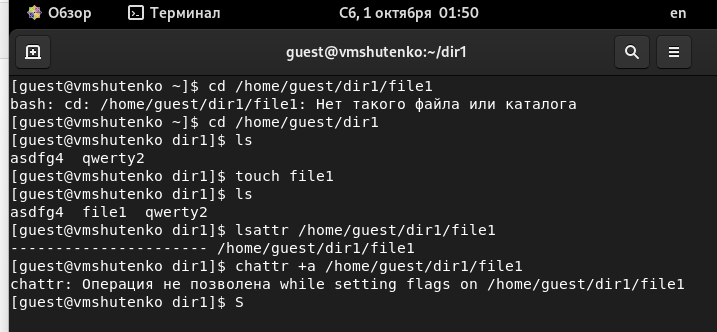

---
# Front matter
title: "Отчёт по лабораторной работе №4"
subtitle: "Дискреционное
разграничение прав в Linux. Расширенные
атрибуты"
author: "Виктория Михайловна Шутенко"

# Generic otions
lang: ru-RU
toc-title: "Содержание"

# Bibliography
bibliography: bib/cite.bib
csl: pandoc/csl/gost-r-7-0-5-2008-numeric.csl

# Pdf output format
toc: true # Table of contents
toc_depth: 2
lof: true # List of figures
lot: true # List of tables
fontsize: 12pt
linestretch: 1.5
papersize: a4
documentclass: scrreprt
## I18n
polyglossia-lang:
  name: russian
  options:
	- spelling=modern
	- babelshorthands=true
polyglossia-otherlangs:
  name: english
  name: el
### Fonts
mainfont: PT Serif
romanfont: PT Serif
sansfont: PT Sans
monofont: PT Mono
mainfontoptions: Ligatures=TeX
romanfontoptions: Ligatures=TeX
sansfontoptions: Ligatures=TeX,Scale=MatchLowercase
monofontoptions: Scale=MatchLowercase,Scale=0.9
## Biblatex
biblatex: true
biblio-style: "gost-numeric"
biblatexoptions:
  - parentracker=true
  - backend=biber
  - hyperref=auto
  - language=auto
  - autolang=other*
  - citestyle=gost-numeric
## Misc options
indent: true
header-includes:
  - \linepenalty=10 # the penalty added to the badness of each line within a paragraph (no associated penalty node) Increasing the value makes tex try to have fewer lines in the paragraph.
  - \interlinepenalty=0 # value of the penalty (node) added after each line of a paragraph.
  - \hyphenpenalty=50 # the penalty for line breaking at an automatically inserted hyphen
  - \exhyphenpenalty=50 # the penalty for line breaking at an explicit hyphen
  - \binoppenalty=700 # the penalty for breaking a line at a binary operator
  - \relpenalty=500 # the penalty for breaking a line at a relation
  - \clubpenalty=150 # extra penalty for breaking after first line of a paragraph
  - \widowpenalty=150 # extra penalty for breaking before last line of a paragraph
  - \displaywidowpenalty=50 # extra penalty for breaking before last line before a display math
  - \brokenpenalty=100 # extra penalty for page breaking after a hyphenated line
  - \predisplaypenalty=10000 # penalty for breaking before a display
  - \postdisplaypenalty=0 # penalty for breaking after a display
  - \floatingpenalty = 20000 # penalty for splitting an insertion (can only be split footnote in standard LaTeX)
  - \raggedbottom # or \flushbottom
  - \usepackage{float} # keep figures where there are in the text
  - \floatplacement{figure}{H} # keep figures where there are in the text

---

# Цель работы

Получение практических навыков работы в консоли с расширенными атрибутами файлов.

# Ход работы 

1. От имени пользователя guest определила расширенные атрибуты файла /home/guest/dir1/file1 командой

```
lsattr /home/guest/dir1/file1
```

2. Установила командой ```chmod 600 file1``` на файл file1 права, разрешающие чтение и запись для владельца файла.
3. Попробовала установить на файл /home/guest/dir1/file1 расширенный атрибут a от имени пользователя guest:

```
chattr +a /home/guest/dir1/file1
```

В ответ получила отказ от выполнения операции.

{ #fig:001 width=70% }

4. Зашла на третью консоль с правами администратора и повысила свои права с помощью команды su. Попробовала установить расширенный атрибут a на файл /home/guest/dir1/file1 от имени суперпользователя:

```
chattr +a /home/guest/dir1/file1
```
{ #fig:002 width=70% }

5. От пользователя guest проверила правильность установления атрибута:

```
lsattr /home/guest/dir1/file1
```

{ #fig:003 width=70% }

6. Выполнила дозапись в файл file1 слова «test» командой

```
echo "test" /home/guest/dir1/file1
```

После этого выполнила чтение файла file1 командой

```
cat /home/guest/dir1/file1
```


Убедилась, что слово test было успешно записано в file1.

7. Попробовала стереть имеющуюся в файле file1 информацию командой

```
echo "abcd" > /home/guest/dirl/file1
```

Попробовала переименовать файл.
8. Попробовала с помощью команды ```chmod 000 file1``` установить на файл file1 права запрещающие чтение и запись для владельца файла. 

{ #fig:004 width=70% }

9. Сняла расширенный атрибут a с файла /home/guest/dirl/file1 от имени суперпользователя командой

```chattr -a /home/guest/dir1/file1```

Повторила операции, которые ранее не удавалось выполнить. 

{ #fig:005 width=70% }

{ #fig:006 width=70% }

10. Повторила мои действия по шагам, заменив атрибут «a» атрибутом «i».

{ #fig:007 width=70% }

{ #fig:008 width=70% }

Таблица прав для расширенных атрибутов


|Операция            |Без расш. атрибутов|С расш. атрибутом a|С расш. атрибутом i|
|--------------------|-------------------|-------------------|-------------------|
|Заапись в файл      |         -         |       -           |        -          |
|Чтение файла        |         +         |       +           |        +          |
|Перезапись в файл   |         +         |       -           |        -          |
|Переименование файла|         +         |       -           |        -          |
|Удаление файла      |         +         |       -           |        -          |
|Установка прав      |         -         |       +           |        -          |

# Итоги выполнения лабораторной работы

- Получили практические навыки работы в консоли с расширенными атрибутами файлов;
- Заполнили таблицу.

