---
# Front matter
title: "Отчёт по лабораторной работе №5"
subtitle: "Дискреционное разграничение прав в Linux. Исследование влияния дополнительных атрибутов"
author: "Виктория Михайловна Шутенко"

# Generic otions
lang: ru-RU
toc-title: "Содержание"

# Bibliography
bibliography: bib/cite.bib
csl: pandoc/csl/gost-r-7-0-5-2008-numeric.csl

# Pdf output format
toc: true # Table of contents
toc_depth: 2
lof: true # List of figures
lot: true # List of tables
fontsize: 12pt
linestretch: 1.5
papersize: a4
documentclass: scrreprt
## I18n
polyglossia-lang:
  name: russian
  options:
	- spelling=modern
	- babelshorthands=true
polyglossia-otherlangs:
  name: english
  name: el
### Fonts
mainfont: PT Serif
romanfont: PT Serif
sansfont: PT Sans
monofont: PT Mono
mainfontoptions: Ligatures=TeX
romanfontoptions: Ligatures=TeX
sansfontoptions: Ligatures=TeX,Scale=MatchLowercase
monofontoptions: Scale=MatchLowercase,Scale=0.9
## Biblatex
biblatex: true
biblio-style: "gost-numeric"
biblatexoptions:
  - parentracker=true
  - backend=biber
  - hyperref=auto
  - language=auto
  - autolang=other*
  - citestyle=gost-numeric
## Misc options
indent: true
header-includes:
  - \linepenalty=10 # the penalty added to the badness of each line within a paragraph (no associated penalty node) Increasing the value makes tex try to have fewer lines in the paragraph.
  - \interlinepenalty=0 # value of the penalty (node) added after each line of a paragraph.
  - \hyphenpenalty=50 # the penalty for line breaking at an automatically inserted hyphen
  - \exhyphenpenalty=50 # the penalty for line breaking at an explicit hyphen
  - \binoppenalty=700 # the penalty for breaking a line at a binary operator
  - \relpenalty=500 # the penalty for breaking a line at a relation
  - \clubpenalty=150 # extra penalty for breaking after first line of a paragraph
  - \widowpenalty=150 # extra penalty for breaking before last line of a paragraph
  - \displaywidowpenalty=50 # extra penalty for breaking before last line before a display math
  - \brokenpenalty=100 # extra penalty for page breaking after a hyphenated line
  - \predisplaypenalty=10000 # penalty for breaking before a display
  - \postdisplaypenalty=0 # penalty for breaking after a display
  - \floatingpenalty = 20000 # penalty for splitting an insertion (can only be split footnote in standard LaTeX)
  - \raggedbottom # or \flushbottom
  - \usepackage{float} # keep figures where there are in the text
  - \floatplacement{figure}{H} # keep figures where there are in the text

---

# Цель работы

Изучение механизмов изменения идентификаторов, применения
SetUID- и Sticky-битов. Получение практических навыков работы в консоли с дополнительными атрибутами. Рассмотрение работы механизма
смены идентификатора процессов пользователей, а также влияние бита
Sticky на запись и удаление файлов.1

# Подготовка к выполнению лабораторной работы №5

Я выполнила подготовительные действия перед началом выполнения лабораторной работы - проверила наличие gcc и g++

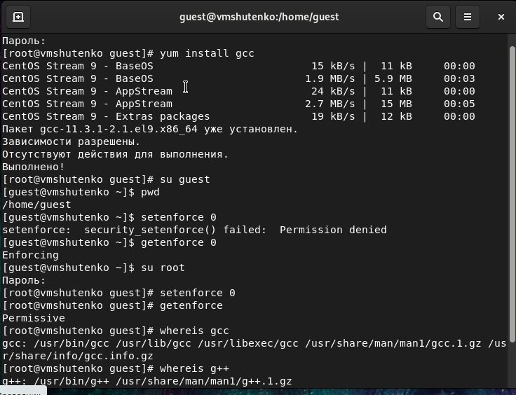{ #fig:001 width=70% }

# Ход работы

## Создание программы

1. Вошла в систему от имени пользователя guest.
2. Создала программу simpleid.c:

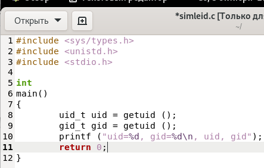{ #fig:002 width=70% }

3. Скомплилировала программу и убедилась, что файл программы создан:

```
gcc simpleid.c -o simpleid
```

4. Выполнила программу simpleid:

```
./simpleid
```

5. Выполнила системную программу id:

```
id
```

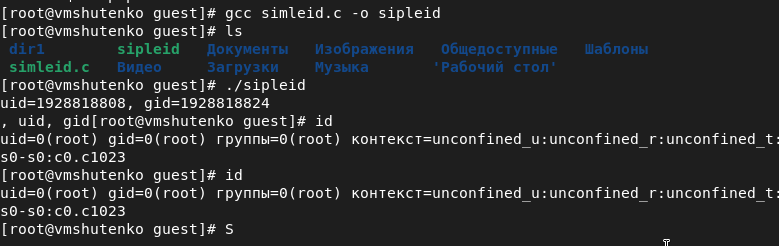{ #fig:003 width=70% }

6. Усложнила программу, добавив вывод действительных идентификаторов:

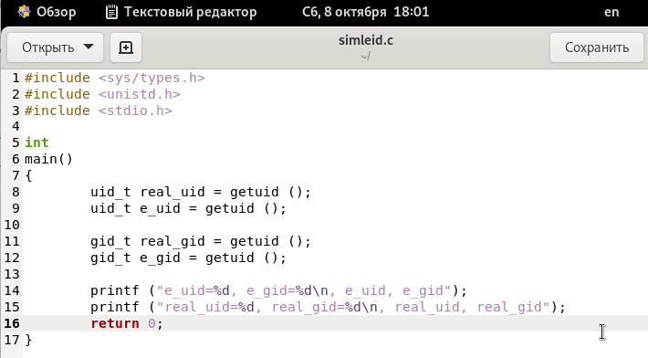{ #fig:004 width=70% }

7. Скомпилировала и запустила simpleid2.c:

```
gcc simpleid2.c -o simpleid2
./simpleid2
```


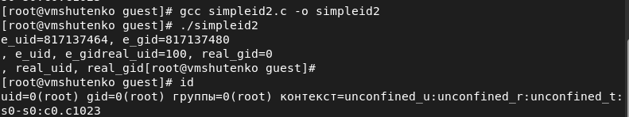{ #fig:005 width=70% }

8. От имени суперпользователя выполнила команды:

```
chown root:guest /home/guest/simpleid2
chmod u+s /home/guest/simpleid2
```

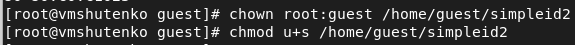{ #fig:006 width=70% }

9. Использовала sudo и временно повысила свои права.

10. Выполнила проверку правильности установки новых атрибутов и смены владельца файла simpleid2:

```
ls -l simpleid2
```

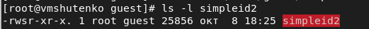{ #fig:007 width=70% }

11. Запустила simpleid2 и id:

```
./simpleid2
id
```

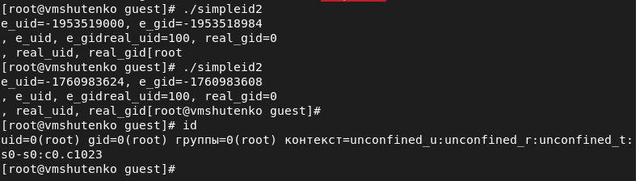{ #fig:008 width=70% }

12. Проделала тоже самое относительно SetGID-бита.

13. Создала программу readfile.c:

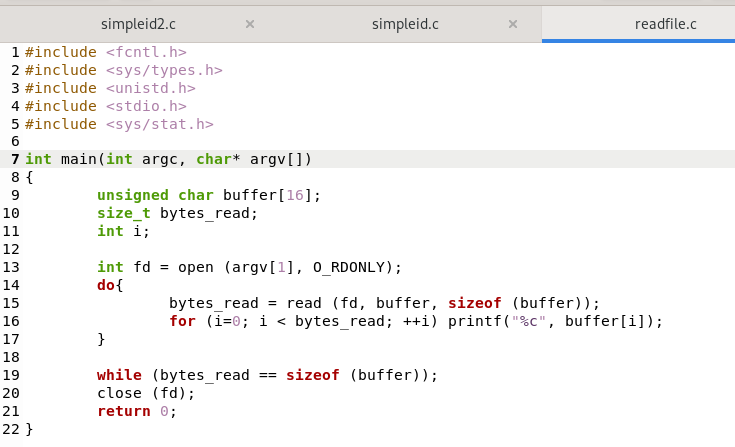{ #fig:009 width=70% }

14. Откомпилировала её.

```
gcc readfile.c -o readfile
```

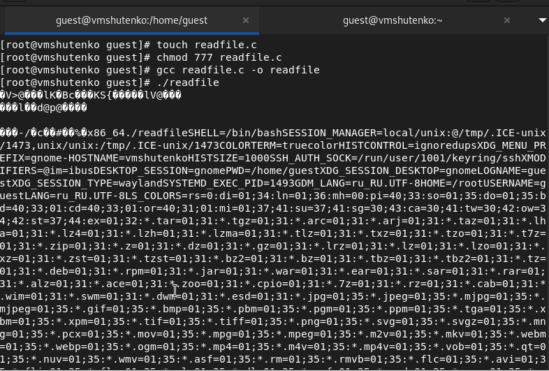{ #fig:010 width=70% }

15. Сменила владельца у файла readfile.c и изменила права так, чтобы только суперпользователь (root) мог прочитать его, a guest не мог.

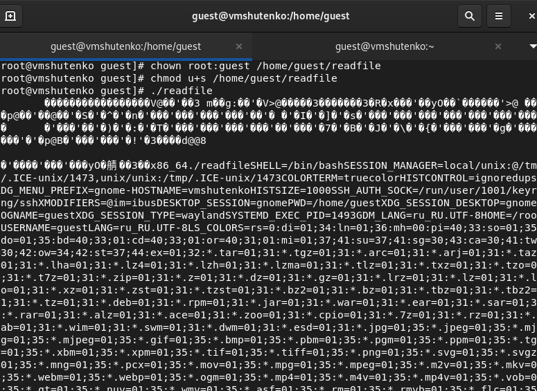{ #fig:011 width=70% }

16. Проверила, что пользователь guest не может прочитать файл readfile.c.

17. Сменила у программы readfile владельца и установите SetU’D-бит.

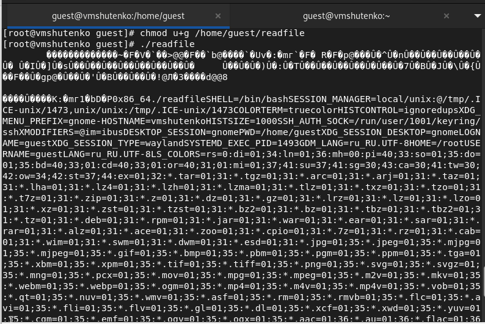{ #fig:012 width=70% }

## Исследование Sticky-бита

1. Выяснила, установлен ли атрибут Sticky на директории /tmp, для чего выполнила команду

```
ls -l / | grep tmp
```

2. От имени пользователя guest создала файл file01.txt в директории /tmp со словом test:

```
echo "test" > /tmp/file01.txt
````

3. Просмотрела атрибуты у только что созданного файла и разрешила чтение и запись для категории пользователей «все остальные»:

```
ls -l /tmp/file01.txt
chmod o+rw /tmp/file01.txt
ls -l /tmp/file01.txt
```

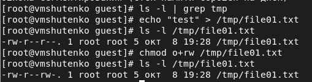{ #fig:013 width=70% }

4. От пользователя guest2 (не являющегося владельцем) попробовала прочитать файл /tmp/file01.txt:

```
cat /tmp/file01.txt
```

5. От пользователя guest2 попробовала дозаписать в файл /tmp/file01.txt слово test2 командой

```
echo "test2" > /tmp/file01.txt
```

6. Проверила содержимое файла командой

```
cat /tmp/file01.txt
```

7. От пользователя guest2 попробовала записать в файл /tmp/file01.txt слово test3, стерев при этом всю имеющуюся в файле информацию командой

```
echo "test3" > /tmp/file01.txt
```

8. Проверила содержимое файла командой

```
cat /tmp/file01.txt
```

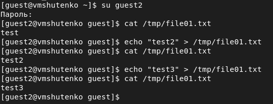{ #fig:014 width=70% }

9. От пользователя guest2 попробовала удалить файл /tmp/file01.txt командой

```
rm /tmp/fileOl.txt
```


10. Повысила свои права до суперпользователя следующей командой

```
su -
```

и выполнила после этого команду, снимающую атрибут t (Sticky-бит) с
директории /tmp:

```
chmod -t /tmp
```

11. Покинула режим суперпользователя командой

```
exit
```

12. От пользователя guest2 проверила, что атрибута t у директории /tmp нет:

```
ls -l / | grep tmp
```

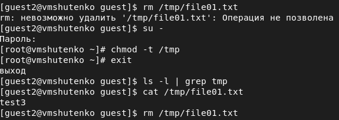{ #fig:015 width=70% }


# Итоги выполнения лабораторной работы

- Получили практические навыки работы в консоли с расширенными атрибутами файлов;
- Заполнили таблицу.

