---
## Front matter
lang: ru-RU
title: Лабораторная работа №6
subtitle: Мандатное разграничение прав в Linux атрибутов
author: Victoria M. Shutenko
institute: RUDN University, Moscow, Russian Federation
date: 15 October, 2022, Moscow, Russian Federation

## Formatting
toc: false
slide_level: 2
theme: metropolis
header-includes: 
 - \metroset{progressbar=frametitle,sectionpage=progressbar,numbering=fraction}
 - '\makeatletter'
 - '\beamer@ignorenonframefalse'
 - '\makeatother'
aspectratio: 43
section-titles: true
---

# Цель выполнения лабораторной работы

Развить навыки администрирования ОС Linux. Получить первое практическое знакомство с технологией SELinux1.
Проверить работу SELinx на практике совместно с веб-сервером Apache.

# Результаты выполнения лабораторной работ

## Подготовка к выполнению лабораторной работы №6

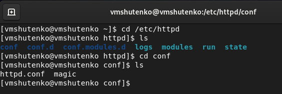{ #fig:001 width=70% }

## Подготовка к выполнению лабораторной работы №6

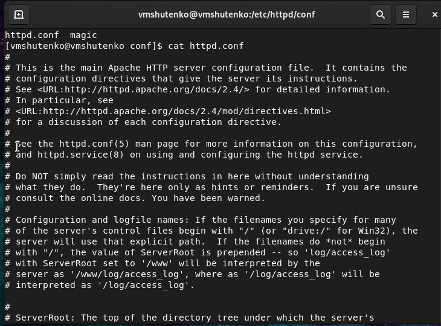{ #fig:002 width=70% }

## Подготовка к выполнению лабораторной работы №6

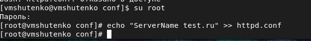{ #fig:003 width=70% }

## Подготовка к выполнению лабораторной работы №6

{ #fig:004 width=70% }

## Подготовка к выполнению лабораторной работы №6

{ #fig:005 width=70% }

## Работа SELinux в режиме enforcing.

{ #fig:006 width=70% }

## Проверка работоспособности веб-сервера с помощью браузера

{ #fig:007 width=70% }

## Контекст безопасности

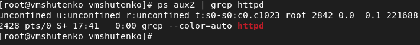{ #fig:008 width=70% }

## Текущее состояние переключателей SELinux для Apache 

{ #fig:009 width=70% }

## Статистика по политике.

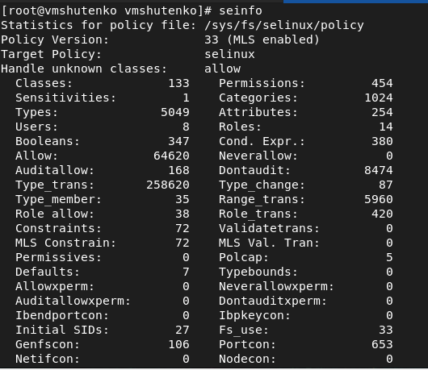{ #fig:010 width=70% }

## Определение типов файлов и поддиректорий, находящихся в директории /var/www и в директории /var/www/html:

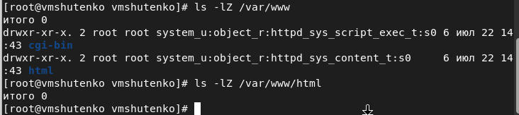{ #fig:011 width=70% }

## Круг пользователей, которым разрешено создание файлов в директории /var/www/html.

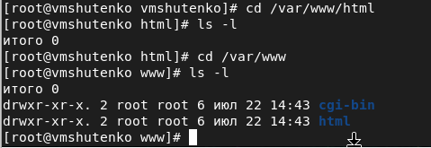{ #fig:012 width=70% }

## Создание html-файл /var/www/html/test.html 

{ #fig:013 width=70% }

## Проверка, изменение и просмотр контекста 

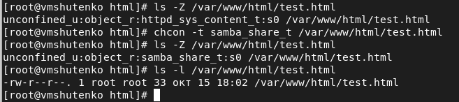{ #fig:014 width=70% }

## Просмотр log-файлов веб-сервера Apache. 

{ #fig:015 width=70% }

## Изменение Listen 80 на Listen 81 в файле httpd.conf.

{ #fig:016 width=70% }

## Просмотр лог-файлов:

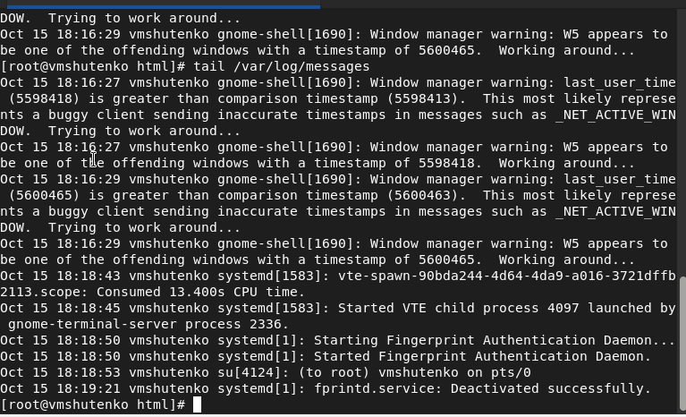{ #fig:017 width=70% }

## Просмотр лог-файла audit.log 

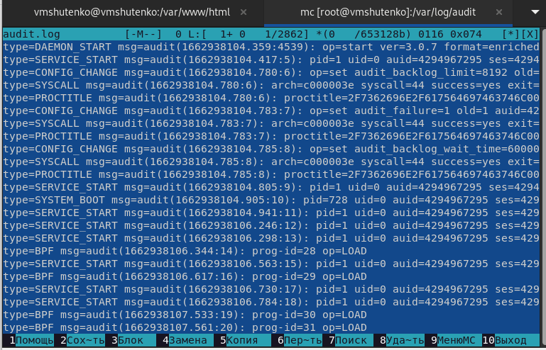{ #fig:018 width=70% }

## Добавление порта 81.

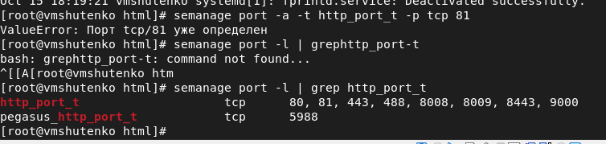{ #fig:019 width=70% }

## Удаление порта 81.

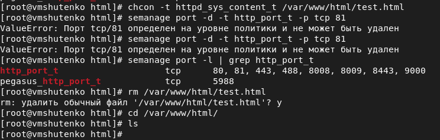{ #fig:020 width=70% }

# Итоги выполнения лабораторной работы

- Получили первое практическое знакомство с технологией SELinux1.
- Проверили работу SELinx на практике совместно с веб-сервером Apache.
- Создали файл test.html.

