---
# Front matter
title: "Отчёт по лабораторной работе №6"
subtitle: "Мандатное разграничение прав в Linux"
author: "Виктория Михайловна Шутенко"

# Generic otions
lang: ru-RU
toc-title: "Содержание"

# Bibliography
bibliography: bib/cite.bib
csl: pandoc/csl/gost-r-7-0-5-2008-numeric.csl

# Pdf output format
toc: true # Table of contents
toc_depth: 2
lof: true # List of figures
lot: true # List of tables
fontsize: 12pt
linestretch: 1.5
papersize: a4
documentclass: scrreprt
## I18n
polyglossia-lang:
  name: russian
  options:
	- spelling=modern
	- babelshorthands=true
polyglossia-otherlangs:
  name: english
  name: el
### Fonts
mainfont: PT Serif
romanfont: PT Serif
sansfont: PT Sans
monofont: PT Mono
mainfontoptions: Ligatures=TeX
romanfontoptions: Ligatures=TeX
sansfontoptions: Ligatures=TeX,Scale=MatchLowercase
monofontoptions: Scale=MatchLowercase,Scale=0.9
## Biblatex
biblatex: true
biblio-style: "gost-numeric"
biblatexoptions:
  - parentracker=true
  - backend=biber
  - hyperref=auto
  - language=auto
  - autolang=other*
  - citestyle=gost-numeric
## Misc options
indent: true
header-includes:
  - \linepenalty=10 # the penalty added to the badness of each line within a paragraph (no associated penalty node) Increasing the value makes tex try to have fewer lines in the paragraph.
  - \interlinepenalty=0 # value of the penalty (node) added after each line of a paragraph.
  - \hyphenpenalty=50 # the penalty for line breaking at an automatically inserted hyphen
  - \exhyphenpenalty=50 # the penalty for line breaking at an explicit hyphen
  - \binoppenalty=700 # the penalty for breaking a line at a binary operator
  - \relpenalty=500 # the penalty for breaking a line at a relation
  - \clubpenalty=150 # extra penalty for breaking after first line of a paragraph
  - \widowpenalty=150 # extra penalty for breaking before last line of a paragraph
  - \displaywidowpenalty=50 # extra penalty for breaking before last line before a display math
  - \brokenpenalty=100 # extra penalty for page breaking after a hyphenated line
  - \predisplaypenalty=10000 # penalty for breaking before a display
  - \postdisplaypenalty=0 # penalty for breaking after a display
  - \floatingpenalty = 20000 # penalty for splitting an insertion (can only be split footnote in standard LaTeX)
  - \raggedbottom # or \flushbottom
  - \usepackage{float} # keep figures where there are in the text
  - \floatplacement{figure}{H} # keep figures where there are in the text

---

# Цель работы

Развить навыки администрирования ОС Linux. Получить первое практическое знакомство с технологией SELinux1.
Проверить работу SELinx на практике совместно с веб-сервером
Apache.

# Подготовка к выполнению лабораторной работы №6

Сначала я выполнила подготовительные действия для стенда лабораторной работы №6:

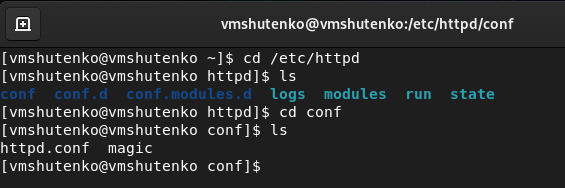{ #fig:001 width=70% }

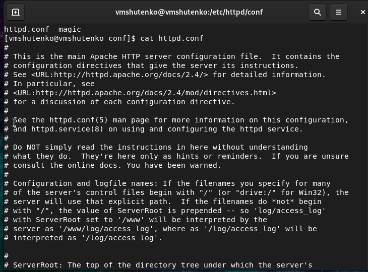{ #fig:002 width=70% }

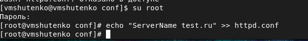{ #fig:003 width=70% }

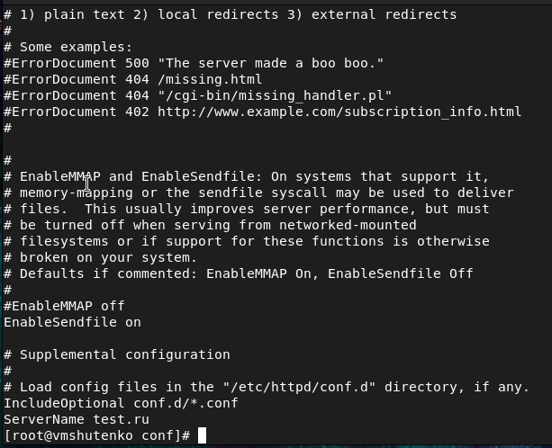{ #fig:004 width=70% }

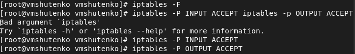{ #fig:005 width=70% }

# Ход работы

1. Вошла в систему с полученными учётными данными и убедилась, что SELinux работает в режиме enforcing политики targeted с помощью команд ```getenforce``` и ```sestatus```.

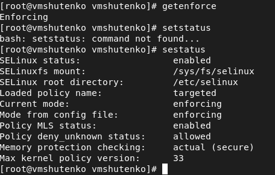{ #fig:006 width=70% }

2. Обратилась с помощью браузера к веб-серверу, запущенному на моем компьютере, и убедилась, что последний работает:

```
service httpd status
```

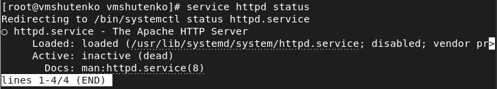{ #fig:007 width=70% }

3. Нашла веб-сервер Apache в списке процессов, определила его контекст безопасности, используя команду

```
ps auxZ | grep httpd
```

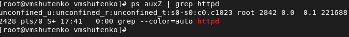{ #fig:008 width=70% }

4. Посмотрела текущее состояние переключателей SELinux для Apache с помощью команды

```
sestatus -bigrep httpd
```

Обратила внимание, что многие из них находятся в положении «off».

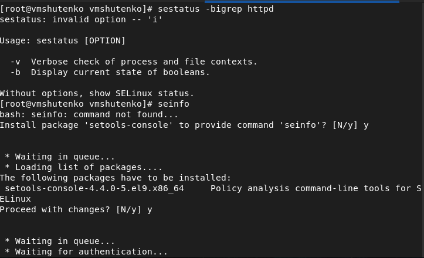{ #fig:009 width=70% }

5. Посмотрела статистику по политике с помощью команды ```seinfo```, определила множество пользователей, ролей, типов.

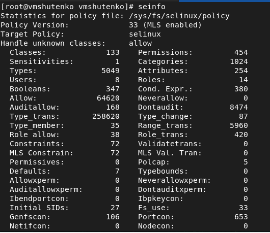{ #fig:010 width=70% }

6. Определила тип файлов и поддиректорий, находящихся в директории /var/www, с помощью команды

```
ls -lZ /var/www
```

7. Определила тип файлов, находящихся в директории /var/www/html:

```
ls -lZ /var/www/html
```

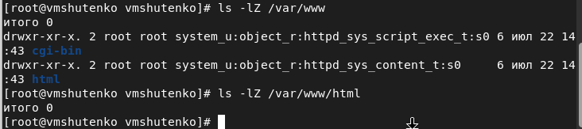{ #fig:011 width=70% }

8. Определила круг пользователей, которым разрешено создание файлов в директории /var/www/html.

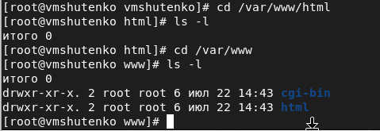{ #fig:012 width=70% }

9. Создала от имени суперпользователя (так как в дистрибутиве после установки только ему разрешена запись в директорию) html-файл /var/www/html/test.html следующего содержания:

```
<html>
<body>test</body>
</html>
```

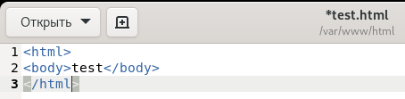{ #fig:013 width=70% }


10. Проверила контекст созданного мною файла.

11. Обратилась к файлу через веб-сервер, введя в браузере адрес http://127.0.0.1/test.html. 

12. Изучила справку man httpd_selinux. Сопоставьте их с типом файла test.html. Проверила контекст файла командой ls -Z.

```
ls -Z /var/www/html/test.html
```

13. Изменила контекст файла /var/www/html/test.html с httpd_sys_content_t на любой другой, к которому процесс httpd не должен иметь доступа, например, на samba_share_t:

```
chcon -t samba_share_t /var/www/html/test.html
ls -Z /var/www/html/test.html
```

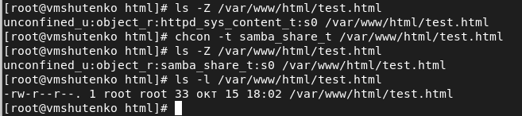{ #fig:014 width=70% }

14. Попробовала ещё раз получить доступ к файлу через веб-сервер, введя в браузере адрес http://127.0.0.1/test.html. 

15. Проанализировала ситуацию. 

```
ls -l /var/www/html/test.html
```

Просмотрела log-файлы веб-сервера Apache. Также просмотрела системный лог-файл:

```
tail /var/log/messages
```

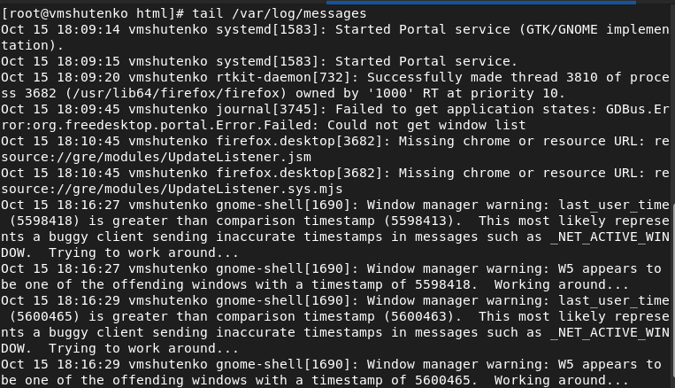{ #fig:015 width=70% }

Если в системе окажутся запущенными процессы setroubleshootd и audtd, то вы также сможете увидеть ошибки, аналогичные указанным выше, в файле /var/log/audit/audit.log.


16. Попробовала запустить веб-сервер Apache на прослушивание ТСР-порта 81 (а не 80, как рекомендует IANA и прописано в /etc/services). Для этого в файле /etc/httpd/httpd.conf нашла строчку Listen 80 и замените её на Listen 81.

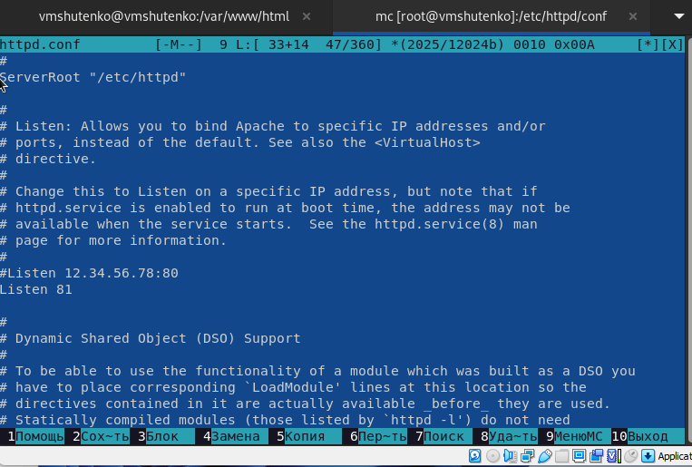{ #fig:016 width=70% }

17. Выполнила перезапуск веб-сервера Apache. 

18. Проанализировала лог-файлы:

```
tail -nl /var/log/messages
```

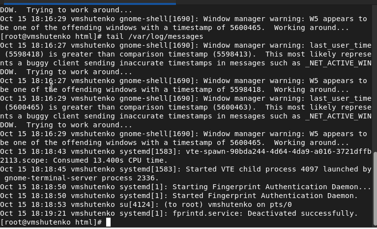{ #fig:017 width=70% }

Просмотрела файлы /var/log/http/error_log, /var/log/http/access_log и /var/log/audit/audit.log 

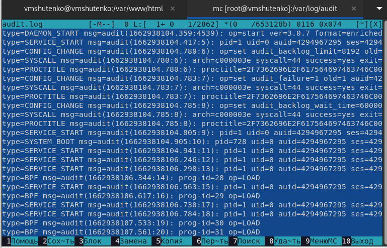{ #fig:018 width=70% }

19. Выполнила команду

```
semanage port -a -t http_port_t -р tcp 81
```

После этого проверила список портов командой

```
semanage port -l | grep http_port_t
```

Убедилась, что порт 81 появился в списке.

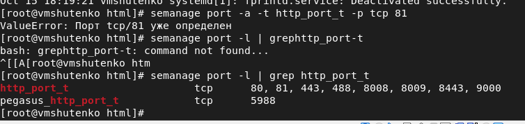{ #fig:019 width=70% }

20. Попробовала запустить веб-сервер Apache ещё раз. 
21. Вернула контекст httpd_sys_cоntent__t к файлу /var/www/html/ test.html:

```
chcon -t httpd_sys_content_t /var/www/html/test.html
```

После этого попробовала получить доступ к файлу через веб-сервер, введя в браузере адрес http://127.0.0.1:81/test.html.

22. Исправила обратно конфигурационный файл apache, вернув Listen 80.
23. Удалила привязку http_port_t к 81 порту:

```
semanage port -d -t http_port_t -p tcp 81
```

24. Удалила файл /var/www/html/test.html:

```
rm /var/www/html/test.html
```


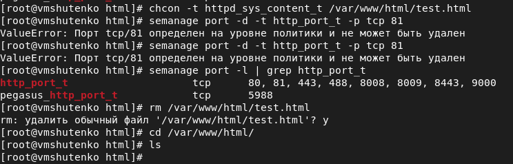{ #fig:020 width=70% }


