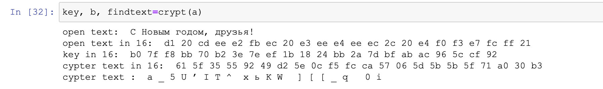
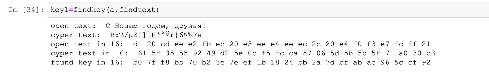

---
## Front matter
lang: ru-RU
title: Лабораторная работа №6
subtitle: Мандатное разграничение прав в Linux атрибутов
author: Victoria M. Shutenko
institute: RUDN University, Moscow, Russian Federation
date: 15 October, 2022, Moscow, Russian Federation

## Formatting
toc: false
slide_level: 2
theme: metropolis
header-includes: 
 - \metroset{progressbar=frametitle,sectionpage=progressbar,numbering=fraction}
 - '\makeatletter'
 - '\beamer@ignorenonframefalse'
 - '\makeatother'
aspectratio: 43
section-titles: true
---

# Цель выполнения лабораторной работы
Освоить на практике применение режима однократного гаммирования.

## Подключение библиотек

```
import numpy as np
import pandas as pd
import sys
```

```
a = "С Новым годом, друзья!"

```

## Функция crypt

```
def crypt(a):
    print("open text: ", a)
    text = []
    for i in a:
        text.append(i.encode("cp1251").hex())
    print("open text in 16: ", *text)
    k = np.random.randint(0, 255, len(a))
    key = [hex(i)[2:] for i in k]
    newkey = []
    for i in key:
        newkey.append(i.encode("cp1251").hex().upper())
    print("key in 16: ", *key)
    b=[]
    for i in range(len(text)):
        b.append("{:02x}".format(int(key[i],16)^int(text[i],16)))
    print("cypter text in 16: ", *b)
    fintext=bytearray.fromhex("".join(b)).decode("cp1251")
    print("cypter text : ", *fintext)
    return key, b, fintext

key, b, findtext=crypt(a)
```

{ #fig:001 width=70% }

## Функция findkey

```
def findkey(a, findtext):
    print("open text: ", a, "\ncyper text: ", fintext)
    newtext=[]
    for i in a:
        newtext.append(i.encode("cp1251").hex())
    print("open text in 16: ", *newtext)
    ftext=[]
    for i in findtext:
        ftext.append(i.encode("cp1251").hex())
    print("cyper text in 16: ", *ftext)
    key = [hex(int(i,16)^int(j,16))[2:] for (i,j) in zip(newtext,ftext)]
    print("found key in 16: ", *key)
    return key

key1=findkey(a,findtext)
```

{ #fig:002 width=70% }

## Проверка найденного ключа

```
if key==key1:
    print("correct key")
else:
    print("fail, incorrect key")
```
{ #fig:002 width=70% }

# Итоги

- изучили шифрование в режиме гаммирования
- написали код из 2-х функций для решения задачи