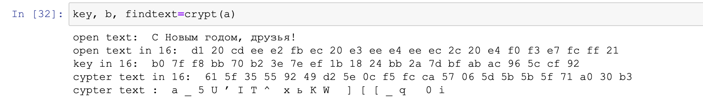
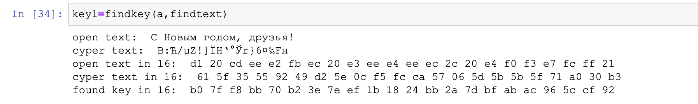

---
# Front matter
title: "Отчёт по лабораторной работе №6"
subtitle: "Мандатное разграничение прав в Linux"
author: "Виктория Михайловна Шутенко"

# Generic otions
lang: ru-RU
toc-title: "Содержание"

# Bibliography
bibliography: bib/cite.bib
csl: pandoc/csl/gost-r-7-0-5-2008-numeric.csl

# Pdf output format
toc: true # Table of contents
toc_depth: 2
lof: true # List of figures
lot: true # List of tables
fontsize: 12pt
linestretch: 1.5
papersize: a4
documentclass: scrreprt
## I18n
polyglossia-lang:
  name: russian
  options:
	- spelling=modern
	- babelshorthands=true
polyglossia-otherlangs:
  name: english
  name: el
### Fonts
mainfont: PT Serif
romanfont: PT Serif
sansfont: PT Sans
monofont: PT Mono
mainfontoptions: Ligatures=TeX
romanfontoptions: Ligatures=TeX
sansfontoptions: Ligatures=TeX,Scale=MatchLowercase
monofontoptions: Scale=MatchLowercase,Scale=0.9
## Biblatex
biblatex: true
biblio-style: "gost-numeric"
biblatexoptions:
  - parentracker=true
  - backend=biber
  - hyperref=auto
  - language=auto
  - autolang=other*
  - citestyle=gost-numeric
## Misc options
indent: true
header-includes:
  - \linepenalty=10 # the penalty added to the badness of each line within a paragraph (no associated penalty node) Increasing the value makes tex try to have fewer lines in the paragraph.
  - \interlinepenalty=0 # value of the penalty (node) added after each line of a paragraph.
  - \hyphenpenalty=50 # the penalty for line breaking at an automatically inserted hyphen
  - \exhyphenpenalty=50 # the penalty for line breaking at an explicit hyphen
  - \binoppenalty=700 # the penalty for breaking a line at a binary operator
  - \relpenalty=500 # the penalty for breaking a line at a relation
  - \clubpenalty=150 # extra penalty for breaking after first line of a paragraph
  - \widowpenalty=150 # extra penalty for breaking before last line of a paragraph
  - \displaywidowpenalty=50 # extra penalty for breaking before last line before a display math
  - \brokenpenalty=100 # extra penalty for page breaking after a hyphenated line
  - \predisplaypenalty=10000 # penalty for breaking before a display
  - \postdisplaypenalty=0 # penalty for breaking after a display
  - \floatingpenalty = 20000 # penalty for splitting an insertion (can only be split footnote in standard LaTeX)
  - \raggedbottom # or \flushbottom
  - \usepackage{float} # keep figures where there are in the text
  - \floatplacement{figure}{H} # keep figures where there are in the text

---

# Цель работы

Освоить на практике применение режима однократного гаммирования.

# Ход работы

Я выполняла лабораторную работу на языке python. Сначала я подключила библиотеки numpy и pandas:

```
import numpy as np
import pandas as pd
import sys
```

По условию лабораторной работы, я создала две функции. Также я задала переменную, содержащую строку, "C Новым годом, друзья!"

```
a = "С Новым годом, друзья!"

```

Первая функция осуществляет перевод в шестнадцатеричную систему, генерирует рандомный ключ с помощью которого будет получаться сообщение в шестнадцатиричной системе и его перевод его в строку. 

```
def crypt(a):
    print("open text: ", a)
    text = []
    for i in a:
        text.append(i.encode("cp1251").hex())
    print("open text in 16: ", *text)
    k = np.random.randint(0, 255, len(a))
    key = [hex(i)[2:] for i in k]
    newkey = []
    for i in key:
        newkey.append(i.encode("cp1251").hex().upper())
    print("key in 16: ", *key)
    b=[]
    for i in range(len(text)):
        b.append("{:02x}".format(int(key[i],16)^int(text[i],16)))
    print("cypter text in 16: ", *b)
    fintext=bytearray.fromhex("".join(b)).decode("cp1251")
    print("cypter text : ", *fintext)
    return key, b, fintext

```
Выполнила вызов этой функции:

```
key, b, findtext=crypt(a)
```
{ #fig:001 width=70% }

Вторая функция определяет ключ, который будет брать открытый текст и шифровать его в шестнадцатеричную систему.


```
def findkey(a, findtext):
    print("open text: ", a, "\ncyper text: ", fintext)
    newtext=[]
    for i in a:
        newtext.append(i.encode("cp1251").hex())
    print("open text in 16: ", *newtext)
    ftext=[]
    for i in findtext:
        ftext.append(i.encode("cp1251").hex())
    print("cyper text in 16: ", *ftext)
    key = [hex(int(i,16)^int(j,16))[2:] for (i,j) in zip(newtext,ftext)]
    print("found key in 16: ", *key)
    return key
```

Выполнила вызов этой функции:

```
key1=findkey(a,findtext)
```

{ #fig:002 width=70% }

Также я осуществила проверку найденного ключа, для этого я создала следующий цикл

```
if key==key1:
    print("correct key")
else:
    print("fail, incorrect key")
```
{ #fig:002 width=70% }

Цикл делает сравнение исходного ключа с найденным. Можно заметить, что они совпадают, поскольку результатом выполнения цикла является correct key. 

# Контрольные вопросы
1. Поясните смысл однократного гаммирования.

Гаммирование – это наложение (снятие) на открытые (зашифрованные) данные криптографической гаммы, т.е. последовательности элементов данных, вырабатываемых с помощью некоторого криптографического алгоритма, для получения зашифрованных (открытых) данных.

2. Перечислите недостатки однократного гаммирования.

Необходимость иметь огромные объемы данных, которые можно было бы использовать в качестве гаммы. Для этих целей обычно пользуются датчиками настоящих случайных чисел. Статистические характеристики таких наборов весьма близки к характеристикам "белого шума", что означает равновероятное появление каждого следующего числа в наборе.

3. Перечислите преимущества однократного гаммирования.

- реализуемость и неизменность шифралгоритма программная и аппаратная;

- преобразования, используемые в шифралгоритме должны быть обратимыми;

- владение шифралгоритмом не должно способствовать вскрытию ключ;

- совпадение объемов (длина шифрованного равна длине исходного) текстов;

- любой возможный ключ должен обеспечивать равновероятную защиту;

- отсутствие просто устанавливаемых зависимостей между ключами в сеансах связи;

- прочтение шифртекста только с соответствующим ключом;

- малые изменения ключа должны существенно менять шифртекст прежнего исходного;

- малые изменения исходного текста при одном ключе существенно меняют шифртекст;

- дополнительные символы к исходному тексту надежно скрываются в шифтексте;

- число операций в атаке перебором ключей ограничивается возможностями компьютера;

- число операций при атаке на ключ должно быть не меньше числа возможных ключей.

4. Почему длина открытого текста должна совпадать с длиной ключа?

Размерности открытого текста и ключа должны совпадать, тогда полученный шифротекст будет такой же длины. 

5. Какая операция используется в режиме однократного гаммирования, назовите её особенности?

Таким образом, последовательность элементов гаммы для использования в режиме гаммирования однозначно определяется ключевыми данными и синхропосылкой. Естественно, для обратимости процедуры шифрования в процессах за- и расшифрования должна использоваться одна и та же синхропосылка. Из требования уникальности гаммы, невыполнение которого приводит к катастрофическому снижению стойкости шифра, следует, что для шифрования двух различных массивов данных на одном ключе необходимо обеспечить использование различных синхропосылок. Это приводит к необходимости хранить или передавать синхропосылку по каналам связи вместе с зашифрованными данными, хотя в отдельных особых случаях она может быть предопределена или вычисляться особым образом, если исключается шифрование двух массивов на одном ключе.


    
    